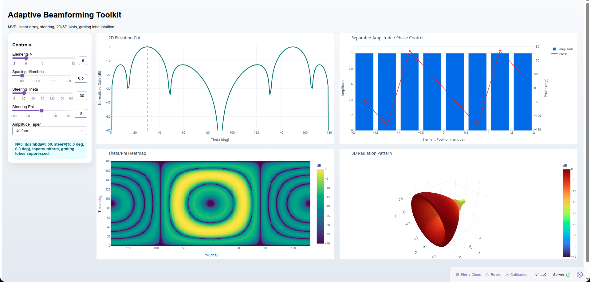
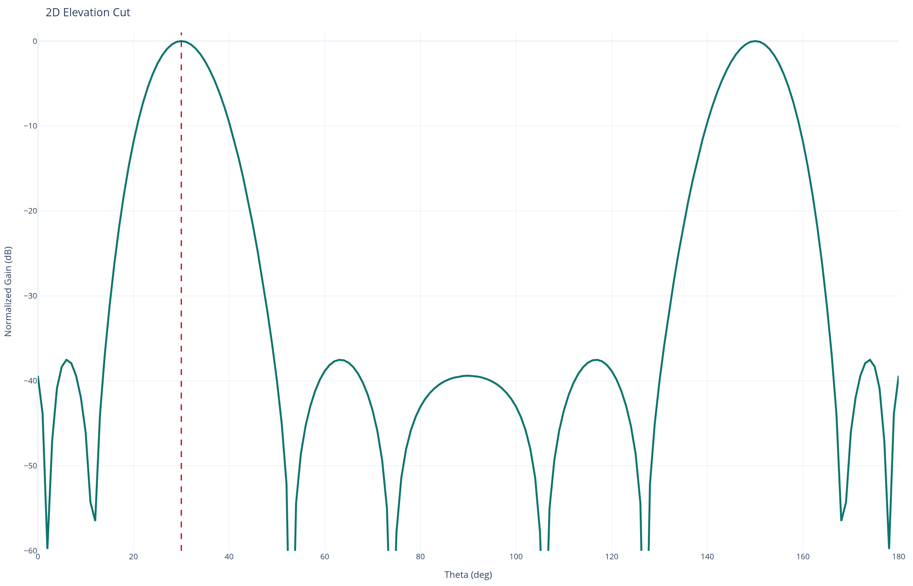
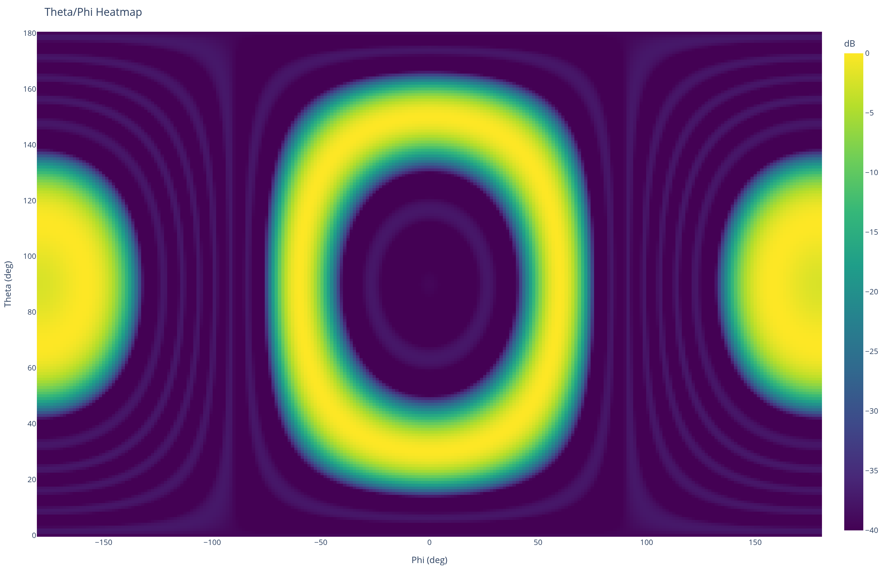
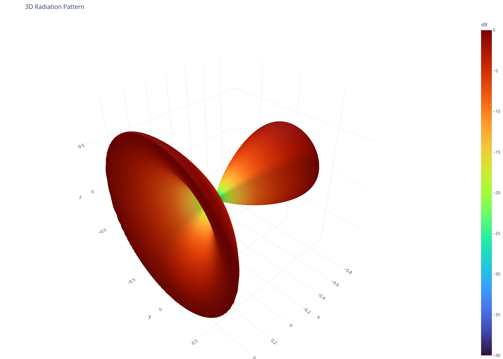
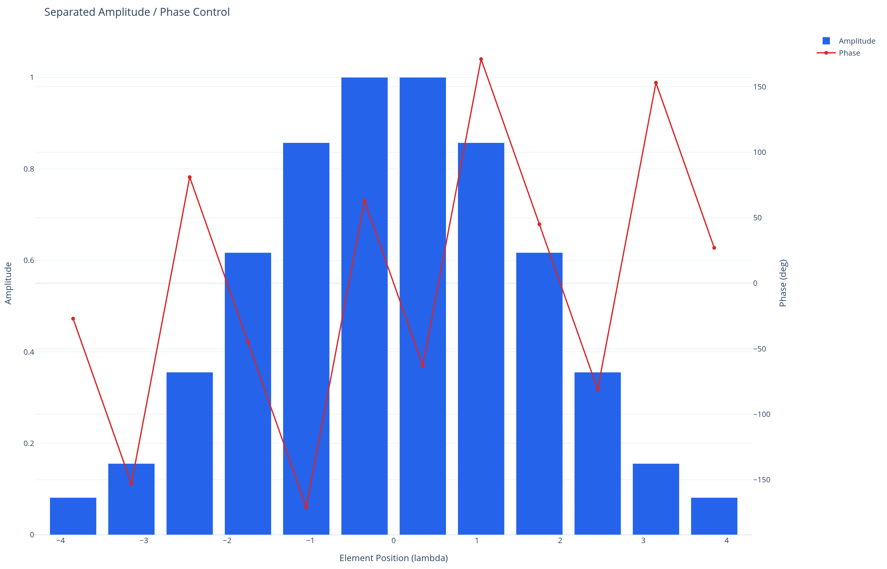

# Adaptive Beamforming Toolkit

Interactive beamforming simulator with a C++ compute core and a Python UI layer.

## Implemented core features

- C++ linear array factor core importable from Python
- C++ planar array factor core importable from Python
- Steering in `theta` and `phi`
- `d/lambda` controls to compare `lambda/2` against larger spacing
- Amplitude tapers: uniform, Hamming, Taylor
- Separate amplitude and phase weights in the core model
- Linear null-steering weights with active interference suppression
- 2D cut, theta/phi heatmap, and interactive 3D pattern
- Dash UI with live controls for the MVP dashboard
- Near-field and far-field linear array models
- Digital, analog, and hybrid beamforming weight synthesis
- Wideband squint simulation with fixed phase-shifter weights
- Element-pattern and mutual-coupling impairment modeling
- MVDR weights and MUSIC DoA estimation utilities
- IQ import helpers and simulation-vs-measurement comparison metrics

## Repo structure

```text
core/        array math and weighting
algorithms/  placeholder for MVDR, MUSIC, nulling
visualize/   plot builders
ui/          Dash dashboard
data/        simulated and measured datasets
notebooks/   demos
docs/        theory notes
```

## Build and run

```bash
python3 -m venv .venv
source .venv/bin/activate
pip install -r requirements.txt
pip install -e .
python app.py
```

Then open `http://127.0.0.1:8050`.

## UI Preview

Full dashboard view:



Key plots:









## Python API

The native core is exposed as `core._beamforming_cpp` and re-exported via `core.beamforming`.

Available entry points include:

- `array_factor_linear(...)`
- `array_factor_planar(...)`
- `steering_weights_linear(...)`
- `steering_weights_planar(...)`
- `null_steering_weights_linear(...)`
- `array_factor_linear_from_weights(...)`

Example:

```python
import numpy as np
from core.beamforming import array_factor_planar, null_steering_weights_linear

theta = np.linspace(0.0, 180.0, 401)[:, None] * np.ones((1, 361))
phi = np.ones((401, 1)) * np.linspace(-180.0, 180.0, 361)[None, :]

planar = array_factor_planar(
    num_x=4,
    num_y=4,
    spacing_x_lambda=0.5,
    spacing_y_lambda=0.5,
    theta_grid_deg=theta,
    phi_grid_deg=phi,
    theta_steer_deg=25.0,
    phi_steer_deg=30.0,
)

weights = null_steering_weights_linear(
    num_elements=8,
    spacing_lambda=0.5,
    theta_steer_deg=0.0,
    phi_steer_deg=0.0,
    null_thetas_deg=np.array([20.0]),
    null_phis_deg=np.array([0.0]),
)
```

## Verification

The core has analytical and reference-driven tests for:

- linear steering accuracy
- half-power beamwidth
- sidelobe levels
- grating lobes
- taper correctness
- planar array factor against an independent NumPy reference
- null-steering constraint satisfaction and notch formation

Run them with:

```bash
source .venv/bin/activate
pytest -q
```

Current status: `13 passed`

## Completed extensions

The roadmap items from the MVP have been implemented in the Python layer:

- `core.advanced_models.array_factor_linear_field_mode(...)` for near-field/far-field modeling
- `core.advanced_models.synthesize_beamforming_architecture(...)` for analog/digital/hybrid approximations
- `core.advanced_models.wideband_array_factor_linear(...)` for beam-squint analysis
- `core.advanced_models.array_factor_linear_with_impairments(...)` and `build_mutual_coupling_matrix(...)`
- `algorithms.adaptive.mvdr_weights(...)` and `algorithms.adaptive.doa_music_linear(...)`
- `data.iq` helpers for IQ load/simulate/beamform and sim-vs-measurement overlays
