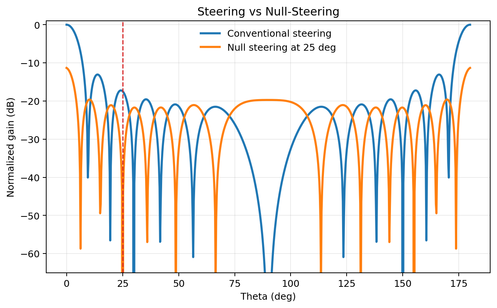
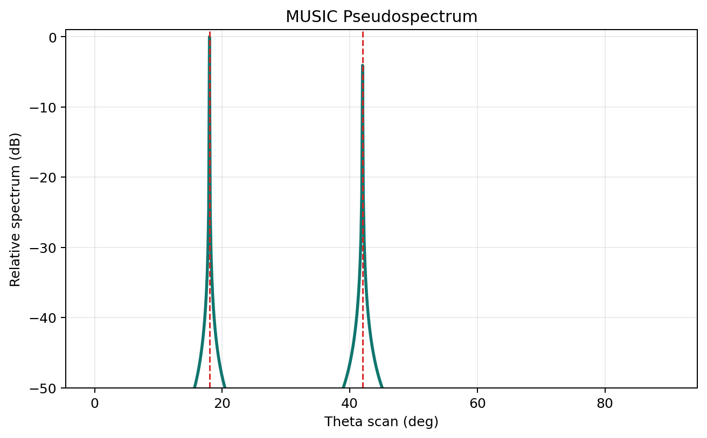
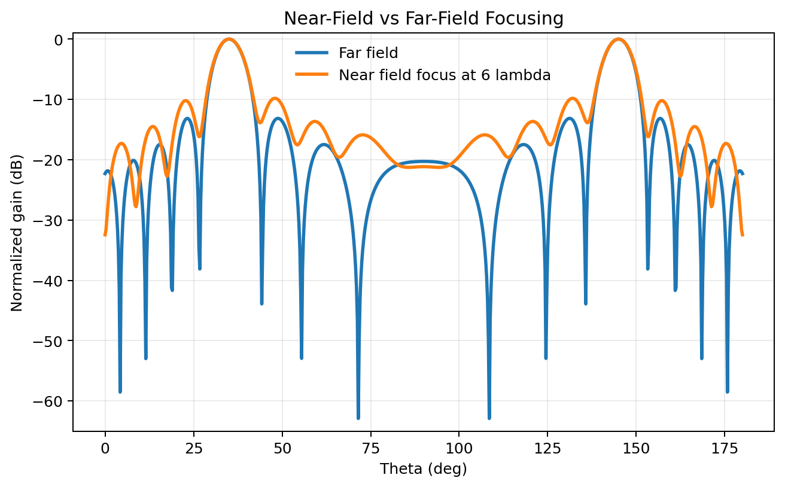
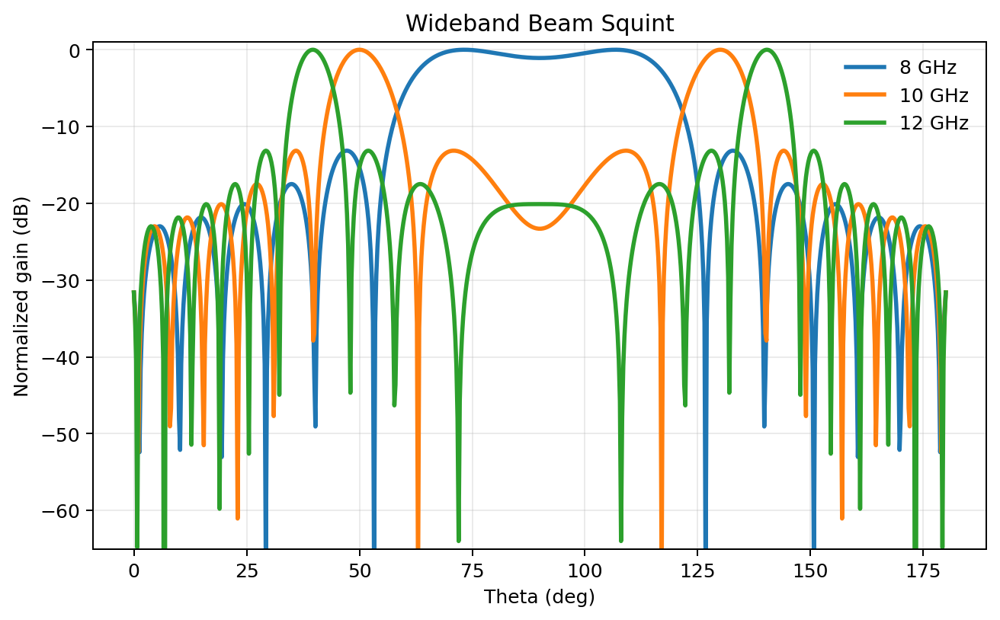
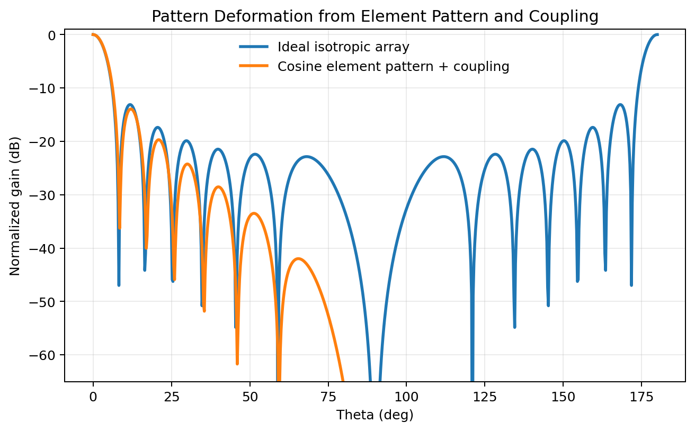

# Algorithms

This document summarizes the methods currently implemented in the repository. The emphasis is on what the code actually does, not on every possible beamforming variant from the literature.

## 1. Conventional Steering

For a desired look direction `(theta_0, phi_0)`, conventional beamforming applies the conjugate steering law

```math
\mathbf{w} \propto \mathbf{a}(\theta_0,\phi_0)
```

or, element-wise for the ULA model,

```math
w_n = \alpha_n e^{-j 2 \pi x_n u(\theta_0,\phi_0)}
```

where:

- `alpha_n` is the amplitude taper
- `x_n` is the centered element position in wavelengths
- `u(theta, phi) = sin(theta) cos(phi)`

In the codebase, this is exposed through:

- `core.beamforming.steering_weights_linear(...)`
- `core.beamforming.steering_weights_planar(...)`
- `core.beamforming.array_factor_linear(...)`
- `core.beamforming.array_factor_planar(...)`

Use this method when you want deterministic steering without data-dependent adaptation.

## 2. Deterministic Null Steering

Null steering imposes linear constraints on the beam response:

```math
\mathbf{w}^H \mathbf{a}(\theta_0,\phi_0)=1
```

and

```math
\mathbf{w}^H \mathbf{a}(\theta_k,\phi_k)=0, \quad k=1,\dots,K
```

The implementation constructs the constraint matrix from the desired steering vector and the null directions, then solves the corresponding linear system in the constraint space.

Implemented entry point:

- `core.beamforming.null_steering_weights_linear(...)`

Reference figure:



Interpretation:

- the main beam is preserved at the desired direction
- deep notches are forced at the specified interference angles
- the method is deterministic and does not estimate covariance from data

## 3. MVDR / Capon Beamforming

MVDR chooses weights that minimize output power while maintaining unit gain in the desired direction:

```math
\min_{\mathbf{w}} \mathbf{w}^H \mathbf{R} \mathbf{w}
\quad \text{subject to} \quad
\mathbf{w}^H \mathbf{a}_0 = 1
```

The closed-form solution is

```math
\mathbf{w}_{MVDR} =
\frac{\mathbf{R}^{-1}\mathbf{a}_0}
{\mathbf{a}_0^H \mathbf{R}^{-1}\mathbf{a}_0}
```

The repository estimates `R` from data and optionally applies diagonal loading:

```math
\mathbf{R}_\delta = \mathbf{R} + \delta \mathbf{I}
```

Implemented entry points:

- `algorithms.adaptive.estimate_covariance_matrix(...)`
- `algorithms.adaptive.mvdr_weights(...)`

Practical notes:

- MVDR needs a steering vector that matches the assumed signal model.
- It is sensitive to covariance conditioning and model mismatch.
- Diagonal loading is often the first stabilization step.

## 4. MUSIC DoA Estimation

MUSIC is a subspace-based direction-of-arrival estimator. It starts from the covariance eigendecomposition:

```math
\mathbf{R} = \mathbf{E}_s \mathbf{\Lambda}_s \mathbf{E}_s^H +
\mathbf{E}_n \mathbf{\Lambda}_n \mathbf{E}_n^H
```

where `E_s` spans the signal subspace and `E_n` spans the noise subspace. For a correct steering vector, the true source directions ideally satisfy orthogonality with the noise subspace. The pseudospectrum is therefore

```math
P_{MUSIC}(\theta,\phi) =
\frac{\|\mathbf{a}(\theta,\phi)\|^2}
\|\mathbf{E}_n^H \mathbf{a}(\theta,\phi)\|^2}
```

The code computes this over a scan grid and returns the largest peaks.

Implemented entry points:

- `algorithms.adaptive.music_spectrum(...)`
- `algorithms.adaptive.doa_music_linear(...)`

Reference figure:



Important boundary:

- the current helper requires the number of sources as an input parameter; it does not estimate model order

## 5. Near-Field Focusing

The near-field model replaces the plane-wave approximation with an element-to-focus distance law:

```math
r_n = \lVert \mathbf{p}_{focus} - \mathbf{p}_n \rVert
```

and

```math
w_n \propto e^{-j 2 \pi r_n}
```

This causes the phase compensation to depend on actual range, not only on direction. The implementation supports both dedicated near-field evaluation and a convenience wrapper that switches between far and near modes.

Implemented entry points:

- `core.advanced_models.steering_weights_near_field_linear(...)`
- `core.advanced_models.array_factor_linear_near_field(...)`
- `core.advanced_models.array_factor_linear_field_mode(...)`

Reference figure:



## 6. Wideband Beam-Squint Analysis

The wideband helper assumes phase-shifter weights are designed at a center frequency `f_0` and then evaluated at other frequencies. The effective electrical spacing scales as

```math
d_{eff}(f) = d \frac{f}{f_0}
```

so the beam direction changes with frequency. This is the classical beam-squint effect of phase-only steering.

Implemented entry point:

- `core.advanced_models.wideband_array_factor_linear(...)`

Reference figure:



## 7. Element Patterns and Mutual Coupling

The impairment-aware array model modifies the ideal response in two ways:

1. It replaces isotropic elements with a scalar directional element gain `g(theta, phi)`.
2. It applies a coupling matrix `C` to the nominal weights.

In simplified form:

```math
\tilde{\mathbf{w}} = \mathbf{C}\mathbf{w}
```

and

```math
H(\theta,\phi) = g(\theta,\phi)\,\tilde{\mathbf{w}}^H \mathbf{a}(\theta,\phi)
```

Implemented entry points:

- `core.advanced_models.element_pattern_gain(...)`
- `core.advanced_models.build_mutual_coupling_matrix(...)`
- `core.advanced_models.array_factor_linear_with_impairments(...)`

Reference figure:



## 8. Digital, Analog, and Hybrid Architectures

The repository also includes a simplified architecture-level mapping from ideal complex weights to three implementation styles:

- digital beamforming: one complex degree of freedom per element
- analog beamforming: phase-only or quantized RF weights
- hybrid beamforming: a small RF network plus reduced-dimension digital weights

The current implementation is not a full hybrid-beamforming optimizer. It is a compact approximation helper useful for comparing how architectural constraints distort ideal weights.

Implemented entry point:

- `core.advanced_models.synthesize_beamforming_architecture(...)`

## 9. Current Adaptive Scope and Omissions

The repository's adaptive-processing surface now includes:

- conventional steering is available as the deterministic baseline
- MVDR/Capon for covariance-based adaptive nulling
- LMS, NLMS, and RLS for supervised adaptive weight updates
- per-frequency-bin wideband MVDR helpers for frequency-domain snapshot data
- MUSIC is available for DoA estimation, not for adaptive weight synthesis
- simple MIMO and polarimetric helper models in the Python API

The repository does not currently ship dedicated implementations of:

- Frost beamforming
- a general LCMV solver
- sparse recovery DoA estimators
- STAP or true time-delay wideband beamforming

Related boundaries:

- MUSIC scanning remains ULA-centric
- wideband adaptive processing is frequency-domain and per-bin, not a full waveform-preserving time-delay beamformer
- the MIMO and polarimetric paths are compact simulation helpers rather than a complete system model

## References

- J. Capon, "High-resolution frequency-wavenumber spectrum analysis," *Proceedings of the IEEE*, 1969. https://ieeexplore.ieee.org/document/1449208
- R. O. Schmidt, "Multiple emitter location and signal parameter estimation," *IEEE Transactions on Antennas and Propagation*, 1986. https://ieeexplore.ieee.org/document/1143830/
- R. J. Mailloux, *Phased Array Antenna Handbook*, 3rd ed., Artech House. https://us.artechhouse.com/Phased-Array-Antenna-Handbook-Third-Edition-P1938.aspx
- C. A. Balanis, *Antenna Theory: Analysis and Design*, 4th ed., Wiley. https://bcs.wiley.com/he-bcs/Books?action=contents&bcsId=9777&itemId=1118642066
